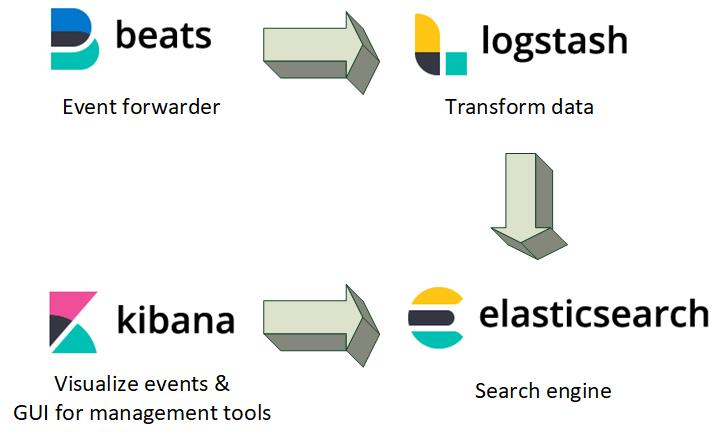
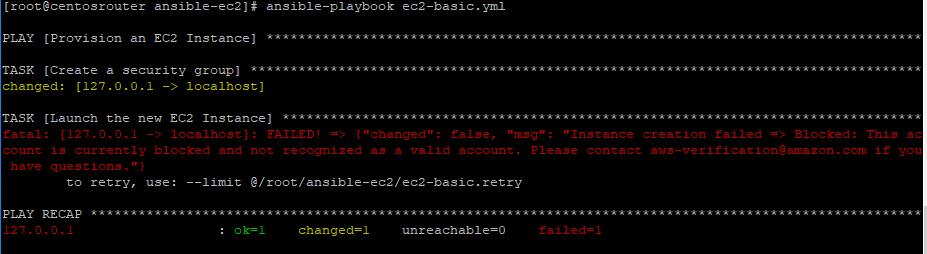

# Snort and ELK in the Cloud feat. Ansible

schuster.stefan92@hotmail.de

ss431@hdm-stuttgart.de

Created for the lecture Software Development for Cloud Computing.

## Motivation 

Imagine a company, where many tech savvy people create a variety of products. They might have many different developers with various technical backgrounds. There are some front end devs that like to code with Typescript, some Go-Enthuasists and maybe some Java-EE devs, that maintain the backend for the front end guys.

Sooner or later they might think about creating their own machines, hosting their solutions to give the world access to their latest solutions. 

Now imagine, that you are working as an administrator for this company. Processes are pretty strict, if  a dev wants their own machine they need to call you and fill out some papers. The future should be looking different. It would be great for your workload if they can press a button and get their own virtual machine in a matter of seconds. This sounds like we can use new technologies to allow this fast launch of instances - sounds like cloud, doesn't it?

Now lets think a step further - what happens if many people create their own, unsupervised Instance in the cloud? That network traffic might get really malicious - the more instances get launched, the more chances are out there to infect our systems.

 A great tool to secure these instances is to track this network traffic with a Network Intrusion Detection System. These alerts need to analysed by our Incident Response Team and need to get tracked. We need to move those alerts to a centrally managed place, where we can search specific alerts - and aggregate the data.

Before we rush things, let us think about the ways to capture network traffic in the cloud - lets see how we traditionally capture traffic and what ways our Cloudprovider AWS is offering us.

### <b> How do we capture our network traffic? </b>

<u>Maybe with a Network TAP or a SPAN?</u>  

Network TAPs are handy little devices, that we can install in our network. They listen to the complete traffic that flows through them and they need therefore be installed at a strategically chosen place. They dont have a MAC or an IP and don't make things complicated for us. But let's be real - we cant convince AWS to install a hardware device in their data center. And it probably wouldn't even work, Cloud environments are virtual networks, so there is no use for a TAP. The same reasons are removing SPAN / Port Mirroring with a Switch for us - it wouldn't work.

<u>But AWS has a service for traffic captur, don't they?</u>

Technically true, VPC offers a service where they track the traffic between our instances. We can download them, track them and use this data in various other solutions in AWS. They call these logs flow logs and they look like this:

We have some information, for example the source IP and port and the destination IP/port, the time when that traffic occured or the protocol. Last but not least, AWS tells us whether the package was allowed or blocked by the security groups. But what this flowlog lacks is in-depth information. Network IDS might need some real informationen, that goes down to the last bit of our packet. So this flowlog is a great way to get a quick glimpse of what is going on, but nothing that can act as a datasource four an network-based IDS.

<u>tcpdump / libpcap</u>

We can't install capture the data through TAPs / SPANs or by using the services of AWS - that leaves us with the option to install a network sniffer directly on the hosts. Additionally, we have the raw data directly from the host. There are now encrypted files and we can maybe even setup a deep package inspection. That's the way we are going to roll for this project.

 But we still need to install tcpdump on every single on of our hosts - a task, that will take increase our workload immense. And we can't ask the devs to do this, they probably won't install it and won't have the time either. Spoiler: they won't, and neither will we - we let software do the grunt work. 

### <b> But how do we filter out the bad traffic from the good one?</b>

That's the cue for a great open source software solution called Snort. Snort is a signature based network IDS, acting as some sort of alarm system for our system. And it gets shipped with with tcpdump / libpcap. 

Let's see how an example rule might look like:

    alert tcp 192.168.0.0/16 80 -> HOME_NET any (msg:"HTTP traffic into homenet"; sid:10000003; rev:001;priority:3)

The rule above is alerting us, whe tcp traffic occurs, with the source IP from the CIDR - Range 192.168.0.0/16 and the port 80. The destination ip needs to be in our home_net, a variable defined by us and the port is any, meaning that every destination port is relevant. With the last part of the rule we assign this rule the creative name "HTTP traffic into homenet" and maybe define a priority for our incident response. 

There are already many rulesets available, for example one community maintained that we can use for free. Snort is offering their own up-to-date ruleset if we pay a subscription.

### <b> Centrally managed alerts and visualizing these events </b>
If Snort detects an alarm, a log file will be created which contains the attributes. These events are at the moment only available on the system - we wouldnt even notice if a system is infected or in danger. Therefore, we need to install software that forwards these events to a central server or even cluster. At this server, we can get an overview of the alerts and visualize every alert, that occured in our cloud instances. 

One open source technology stack which is a great solution for this problem is the ELK-Stack. 
ELK is an abbreviation for Elasticsearch-Logstash-Kibana - additionally, we will use Filebeat, which is a part of the stack, but somehow didn't end up in the name.

Starting with the first part, we have Beats, which forward events (e.g. our snort alerts) from hosts to another destination. Therefore, we need to install filebeat on every single host. 

Alerts need to be preprocessed. We might want to enrich our data with lookups. A http status 404 might be more clear if we translate it to something like "Not Found". Incomoning alerts need to be split up into several attributes. We need to extract the data from the raw messages, which will allow us a more granular approach to aggregate the data.

After logstash processed every alert, we can index the events in a search engine called elasticsearch. Based on lucene, we can write queries which will search specific alerts in the mountain of data, that we will accumulate in our ec2-instances.

Last but not least, Kibana offers a neat Web Interface to issue queries onto elasticsearch. We get Visualiziation-Tools, Index-Management and more features that we can use to gain insight into our alerts.

But the last challenge still must be tackled. How do we install snort and filebeat in every single instance that our devs launch?

### <b>Ansible to the rescue</b>

Ansible is an orchestration software. We can create Playbooks, which contain tasks that we want to get done on our instances. We have a central file, which lists the hosts that we manage and Ansible connects to these instances and performs the tasks, that we need to get done.

But how does Ansible connect to our hosts? It's pretty simple - all that is needed is a ssh-access and an python package installed on our host machines. The management system where we run needs python as well and of course the correct private keys to access these hosts through ssh.

If you create a playbook and you defined your host file, you can install software and patches on hundreds of servers with one single command - exactly the solution for our snort / filebeat problem.

Developing Ansible Playbooks for Snort and Filebeat, I worked closely with VirtualBoxes. A little tip: the snapshot feature is great, use it! It made things really comfortable when developing playbooks. One Task destroyed my machine or made things awkward for the further development? No Problem - restore time!

At the end of my project, I realized that i went through three distinct phases of Ansible knowledge. Lets dive into the creation of Ansible Playbooks.

### <b> The three Stages of Ansible Knowledge </b>

<u>Level 1: direct commands, just like a cmd</u>

Installing snort is mostly done by downloading and compiling different source files. If we head into the cmd of an instance, we would do things like this:

    wget https://www.snort.org/downloads/snort/daq-2.0.6.tar.gz

I collected these commands that need to get called to install Snort and then translated it to severaal tasks in my playbook - the above task in a ansible playbook is looking like this:

    - name: Get daq source for installation
    command: wget https://www.snort.org/downloads/snort/daq-2.0.6.tar.gz
    args:
        chdir: ~/snort_src

It works - but thats it. We dont have a way to interact with this line of code, no response and it's hard coded. We can do things better - Ansible's got our backs covered.

<u>Level 2: Usage of Ansible Modules</u>

Ansible has written modules in Python, that get the most common jobs done. We have Modules for downloading files, extracting archies, yum / apt download or copying files from the ansible manager to our host instances.

For example: If we need to download a tar.gz file and extract this data, we should use the unarchive module:

    - name: Download and extract daq
    unarchive:
        src: https://www.snort.org/downloads/snort/daq-2.0.6.tar.gz
        dest: ~/snort_src/
        validate_certs: false
        remote_src: yes

The usage of modules will improve our playbook by making it more platform independent, more robust and it will clear the way for the next level of ansible knowledge.

Attention:

If you want to change hosts without python, legacy python or brand new operating systems, these modules might fail on the hosts. But the good thing is, you can always go back to your simple cmd-tasks from Level 1.

<u>Level 3: Variables and templates </u>

Managing configurations is a pretty dynamic business. IP-addresses might change, other administrators might want to use your playbook for their own use or maybe you don't want to change 100 places in your configuration.

The first feature we can use are variables. Let's remember our initial problem - we want to send all snort alerts from the hosts to a single server where we process the alerts (with ELK). A great variable would be something like logstash_server, where we define the ip of our central server.

The following snippet is the start of my playbook for the filebeat installation. We define what hosts we want to change (in this case all hosts in the aws section of our host file) and a new section called vars. In vars we define several variables, for example logstashserver.

    ---
    - hosts: aws
    vars:
        logstashserver: 127.0.0.1

Now we can use this variable in our playbook, for example for the usage in our filebeat configuration-file. Ansible works with jinjer templates. In the most simple way to use jinjer Templates, you copy your config file to a new file with the .j2 ending. Afterwards you can define placeholders, where ansible should put our values of the variables.

Our Filebeat Config might look like this:
    
    filebeat.inputs:
    - type: log
      enabled: true
      paths:
        - /var/log/snort/*.csv    

    output.logstash:
      hosts: ["{{ logstashserver }}:5044"]
      ssl.certificate_authorities: ["/etc/filebeat/ca.crt"]
      ssl.certificate: "/etc/filebeat/filebeat_forwarder.crt"
      # verification_mode needs to be none, because we use self signed certificates
      ssl.verification_mode: none
      ssl.key: "/etc/filebeat/filebeat_forwarder.key"

Notice the line with the content {{ logstashserver }}? Thats where we want the value replaced. 

We need to set the value of our variable, before we run our ansible playbook.
The task needed to replace those values and copy the configuration to our host looks like this:

    - name: "create correct filebeat config with jinjer template"  
    template: 
        src: FilebeatFiles/config/filebeat.j2
        dest: "/etc/filebeat/filebeat.yml"
        mode: '755'

### <b> Bringing it all together </b>

To achieve my project goal, I needed to to create three distinct playbooks.

The first playbook was for the launch of ec2-instances. It combines many features and is relatively small. Let's see how this playbook turned out:

We start by defining several variables between line 10 and 15. These define the type of instance, that we want to launch into our cloud infrastructure. The aws-cli combined with Ansible will then launch these instances with the first task.

Because we want to update these newly launched instances in our following playbooks, we register a new variable ec2 in line 28. This will contain all attributes of our instances, for example hostname, keypair, private IP and public IP.

In the second task we will add these public IPs to our ansible host file. The section aws will then contain every ec2-instance that we will maintain. Playbooks started in the future might use this section to refer to those new instances.

The second playbook is for the Snort installation. This playbook is pretty big, if you are interested you can look it up in in my [Github Repo](https://link).

The last playbook revolves around the installlation of Filebeat. 

Most of those tasks are pretty standard - one interesting task that I want to point out starts at line 23. Do you remember the templates with jinjer? This is the place, where we can use this module. We defined in line 4 our logstashserver. The jinjer template will be filled out by ansible and the host receives a new configuration file at the path /etc/filebeat/filebeat.yml. 

To secure the communication between filebeat and logstash we can either use a vpn connection or create directly a ssl-encrypted communication, established by functions from filebeat/logstash. I decided to use the ssl-encrypted communication, where we create some certificates for us and enter the locations in the configuration-files. 

If you want to use my filebeat playbook, you need to create your own certificates and setup the files accordingly to the playbook. 

The setup of Logstash, Elasticsearch and Kibana is another topic, that might fill a complete blog entry on its own. Good tutorials for the setup are the official guides by Elastic. A good tutorial can be found [here](https://https://www.elastic.co/guide/en/logstash/current/installing-logstash.html).

Now you should be able to call every ansible playbook and provide snort to those newly launched ec2-instances with those three calls, in the following order:

    ansible-playbook launch_ec2.yml

    ansible-playbook snort_ubuntu.yml

    ansible-playbook filebeat_ubuntu.yml

If everything works, you can setup some fancy dashboards in Kibana:

### <b> Challenges and how to overcome them </b>

Every project has its problems and tasks, where time is wasted and the solution is often times just a little different approach or a tiny configuration setting.

I want to show you some little problems, that I ran into.

The first problem was my AWS student account. Generally, AWS needs a credit card, even if you register for the free student account, where you will receive some credits for aws services.
If you don't have a credit card - like me for example - you will receive a generic qwiklabs account. The default region that is selected is us-west2. I didn't want to launch ec2-instances in the USA - I switched to eu-west. 

The problem with this account was, that there were many restrictions on the usage of the account. The first playbooks for the ec2-launch were issued with the region eu-west. This failed horribly with the following message:

I thought that my usage of the API-Key was restricted.

Some time later, I wanted to launch some ec2-instances for a second project. The interesting part is, that the AWS web GUI didn't work. My initial thought about a restricted key turned out to be false, it didn't work for eu-west at all.

A little test in the per default selected region us-west-2 showed me, that the launch of instances works - but only in that single availability region. Luckily, the launch with the aws-cli worked properly - opening the way for my initial playbook, that launches ec2-instances.

Funnily enough, some restrictions were given for the launch of those instances. My initial development was for the CentOS operating system in a virtual box. As soon as I had the first alpha release of my playbooks boxes, I wanted to switch from virtual boxes to ec2-instances.

Unlucky me, ec2 only offered me to launch the official images - which didn't contain CentOS. I tried to port my snort installation to RHEL, which seemed to be close to CentOS. After many hours of testing, I realized that my current playbook won't work on this RHEL version due to several Python changes and supported modules.

The fastest way was to port the playbooks to Ubuntu. In a real world environment I would probably ignore the official Python modules and do everything with the cmd Module - cue our Ansible Level 1, that I described earlier.

Another problem, that occured on switching to the cloud platform was based on the python location. Per default, Ansible searches Python under the path /usr/bin/python. If we launch ec2-instances, this path is not set, even though Python is correctly installed. The path to Python3 is /usr/bin/python3.

If the playbook contains an Ansible module, which relies on a Python interpreter on the host machine, it won't find a correct installation. We need to find a way to change this default path, which Ansible will use to work through its task list.

This can be done by adding the variable ansible_python_interpreter to our playbook.

    ansible_python_interpreter: /usr/bin/python3

### <b> And how is Ansible? </b>

Let's start with the following table, where i will outline my biggest advantages and disadvantages.

We have on the one hand an extremely fast setup. Ansible is quickly installed, all you need is Python and SSH - compared to other solutions, where you need to install modules on the hosts, this is unbeatable, and there probably won't be a better approach in the future.

This project was relatively small scaled, we only deal for testing purposes with a few instances. But if you really need to maintain hundreds of instances, you wont update everything by hand. A small script here and there can help, but Ansible is such a mighty tool, that the workload of administrators will be drastically reduced.

But there is a certain negative side, which comes with this power of Ansible. I created some basic playbooks with some variables, a few templates and integrated the aws-cli output into the other playbooks. But I only scratched the surface, Ansible has so many things to offer, which surpasses the used techniques in power and complexity. A really good playbook, which is reusable, robust, dynamic and is still readable needs a lot of experience in the Ansible Universe. 

We have failover, cleanup, Ansible Roles and many more features that are not part of this project. 

I recommend Ansible to every administrator. I guess we can automate more things with only a little bit of effort and the complex and in-depth features of Ansible.

